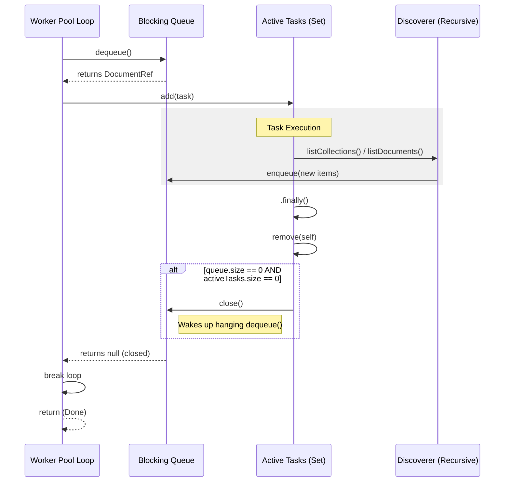

```mermaid
sequenceDiagram
    participant W as Worker Pool Loop
    participant Q as Blocking Queue
    participant T as Active Tasks (Set)
    participant D as Discoverer (Recursive)

    W->>Q: dequeue()
    Q-->>W: returns DocumentRef
    W->>T: add(task)

    rect rgb(240, 240, 240)
    Note over T: Task Execution
    T->>D: listCollections() / listDocuments()
    D->>Q: enqueue(new items)
    end

    T->>T: .finally()
    T->>T: remove(self)

    alt queue.size == 0 AND activeTasks.size == 0
        T->>Q: close()
        Note right of Q: Wakes up hanging dequeue()
    end

    Q-->>W: returns null (closed)
    W->>W: break loop
    W-->>W: return (Done)

```
